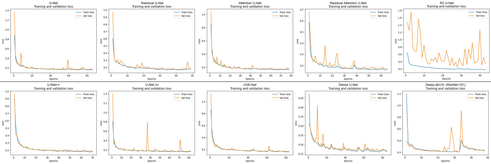
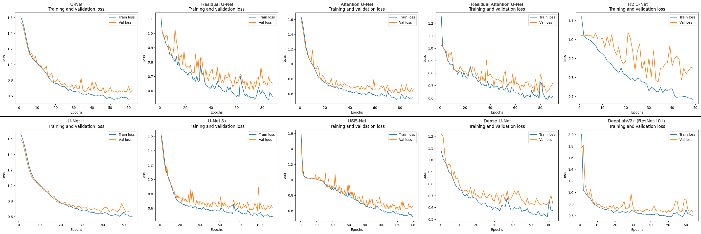
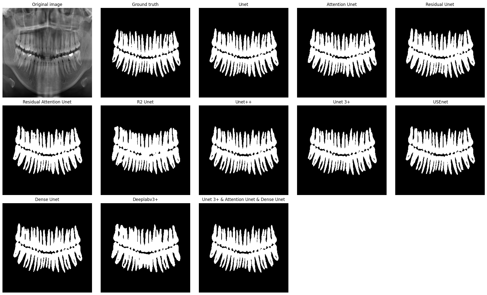
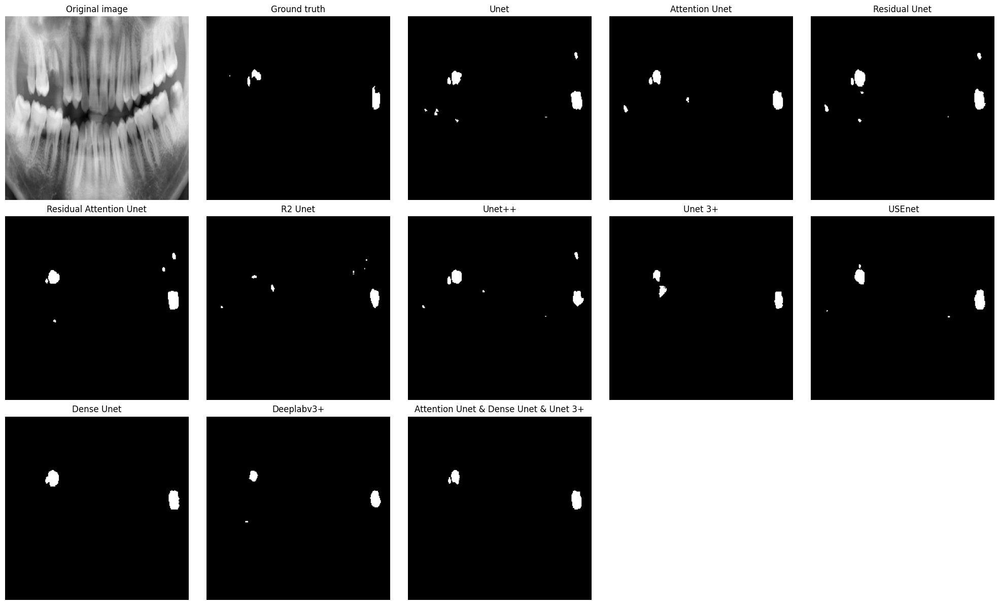

## 📌 Tooth and Caries Segmentation

This project focuses on the development and comparative study of deep learning models for semantic segmentation of teeth and caries on X-ray images.

A total of 10 neural network architectures were implemented, trained, and evaluated for each task. In addition, an ensemble model based on the three best-performing architectures was developed, achieving superior results compared to any individual model.

## 📂 Datasets

Dataset for tooth segmentation (892 high-quality images were selected): https://www.kaggle.com/datasets/truthisneverlinear/childrens-dental-panoramic-radiographs-dataset

Dataset for caries segmentation: https://www.kaggle.com/datasets/mariamosamakhalifa/adult-caries-detection-dataset

## 🧠 Implemented Models

- U-Net
- Attention U-Net
- Residual U-Net
- Residual Attention U-Net
- R2 U-Net
- U-Net++
- U-Net 3+
- USE-Net
- Dense U-Net
- DeepLabV3+ (ResNet-101 backbone)

## 🔗 Ensemble Model

For both segmentation tasks, an ensemble was created using the three best models:

- Dense U-Net
- Attention U-Net
- U-Net 3+

The ensemble consistently outperformed individual models across all evaluation metrics.

## 🛠️ Technologies

- PyTorch
- Albumentations
- OpenCV
- NumPy
- Matplotlib
- TorchMetrics

## 📈 Loss History

### 🦷 Loss History for Tooth Segmentation

### 🦠 Loss History for Caries Segmentation

## 📊 Model Quality Metrics

### 🦷 Model Quality Metrics for Tooth Segmentation (training sample)

| Model                                                 | Loss   | Accuracy   | IoU        | Dice       |
| ----------------------------------------------------- | ------ | ---------- | ---------- | ---------- |
| U-Net                                                 | 0.1546 | 0.9712     | 0.8654     | 0.9276     |
| Attention U-Net                                       | 0.1447 | 0.9736     | 0.8778     | 0.9347     |
| Residual U-Net                                        | 0.1497 | 0.9729     | 0.8751     | 0.9332     |
| Residual Attention U-Net                              | 0.1625 | 0.9698     | 0.8616     | 0.9254     |
| R2 U-Net                                              | 0.2275 | 0.9598     | 0.8184     | 0.8993     |
| U-Net++                                               | 0.1622 | 0.9693     | 0.8580     | 0.9234     |
| U-Net 3+                                              | 0.1451 | 0.9738     | 0.8793     | 0.9356     |
| USE-Net                                               | 0.1547 | 0.9720     | 0.8714     | 0.9311     |
| Dense U-Net                                           | 0.1408 | 0.9745     | 0.8820     | 0.9371     |
| DeepLabV3+ (ResNet-101)                               | 0.2052 | 0.9617     | 0.8312     | 0.9076     |
| **Ensemble (Dense U-Net, Attention U-Net, U-Net 3+)** | –      | **0.9747** | **0.8830** | **0.9377** |

### 🦷 Model Quality Metrics for Tooth Segmentation (test sample)

| Model                                                 | Loss   | Accuracy   | IoU        | Dice       |
| ----------------------------------------------------- | ------ | ---------- | ---------- | ---------- |
| U-Net                                                 | 0.1654 | 0.9682     | 0.8608     | 0.9251     |
| Attention U-Net                                       | 0.1547 | 0.9708     | 0.8725     | 0.9318     |
| Residual U-Net                                        | 0.1556 | 0.9708     | 0.8732     | 0.9321     |
| Residual Attention U-Net                              | 0.1604 | 0.9694     | 0.8678     | 0.9291     |
| R2 U-Net                                              | 0.2247 | 0.9585     | 0.8248     | 0.9036     |
| U-Net++                                               | 0.1749 | 0.9659     | 0.8519     | 0.9199     |
| U-Net 3+                                              | 0.1526 | 0.9715     | 0.8756     | 0.9335     |
| USE-Net                                               | 0.1647 | 0.9691     | 0.8662     | 0.9282     |
| Dense U-Net                                           | 0.1505 | 0.9717     | 0.8766     | 0.9341     |
| DeepLabV3+ (ResNet-101)                               | 0.2133 | 0.9590     | 0.8299     | 0.9069     |
| **Ensemble (Dense U-Net, Attention U-Net, U-Net 3+)** | –      | **0.9721** | **0.8783** | **0.9351** |

### 🦠 Model Quality Metrics for Caries Segmentation (training sample)

| Model                                                 | Loss   | Accuracy   | IoU        | Dice       |
| ----------------------------------------------------- | ------ | ---------- | ---------- | ---------- |
| U-Net                                                 | 0.5601 | 0.9961     | 0.3308     | 0.4679     |
| Attention U-Net                                       | 0.5022 | 0.9963     | 0.3697     | 0.5094     |
| Residual U-Net                                        | 0.5103 | 0.9963     | 0.3632     | 0.4986     |
| Residual Attention U-Net                              | 0.5474 | 0.9960     | 0.3371     | 0.4697     |
| R2 U-Net                                              | 0.7213 | 0.9941     | 0.2104     | 0.3213     |
| U-Net++                                               | 0.5395 | 0.9961     | 0.3442     | 0.4799     |
| U-Net 3+                                              | 0.4666 | 0.9967     | 0.4014     | 0.5413     |
| USE-Net                                               | 0.5104 | 0.9966     | 0.3675     | 0.5017     |
| Dense U-Net                                           | 0.5211 | 0.9961     | 0.3548     | 0.4914     |
| DeepLabV3+ (ResNet-101)                               | 0.5300 | 0.9963     | 0.3446     | 0.4798     |
| **Ensemble (Dense U-Net, Attention U-Net, U-Net 3+)** | –      | **0.9968** | **0.4050** | **0.5447** |

### 🦠 Model Quality Metrics for Caries Segmentation (test sample)

| Model                                                 | Loss   | Accuracy   | IoU        | Dice       |
| ----------------------------------------------------- | ------ | ---------- | ---------- | ---------- |
| U-Net                                                 | 0.4591 | 0.9961     | 0.4180     | 0.5745     |
| Attention U-Net                                       | 0.4286 | 0.9962     | 0.4386     | 0.5961     |
| Residual U-Net                                        | 0.4290 | 0.9962     | 0.4411     | 0.5959     |
| Residual Attention U-Net                              | 0.4382 | 0.9960     | 0.4350     | 0.5899     |
| R2 U-Net                                              | 0.6110 | 0.9944     | 0.2952     | 0.4362     |
| U-Net++                                               | 0.4597 | 0.9960     | 0.4136     | 0.5672     |
| U-Net 3+                                              | 0.4124 | 0.9964     | 0.4584     | 0.6135     |
| USE-Net                                               | 0.4280 | 0.9965     | 0.4426     | 0.5953     |
| Dense U-Net                                           | 0.4278 | 0.9962     | 0.4436     | 0.6002     |
| DeepLabV3+ (ResNet-101)                               | 0.4736 | 0.9961     | 0.3997     | 0.5556     |
| **Ensemble (Dense U-Net, Attention U-Net, U-Net 3+)** | –      | **0.9967** | **0.4753** | **0.6315** |

## 🖼️ Segmentation Results

### 🦷 Results of Tooth Segmentation

### 🦠 Results of Caries Segmentation

